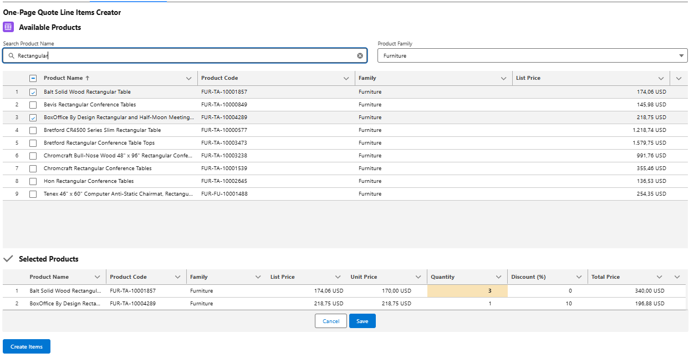

# QuickQliDatatable Lightning Web Component



## Overview

**QuickQliDatatable** is a Salesforce Lightning Web Component (LWC) designed to provide a fast, user-friendly, and modern interface for adding, editing, and creating Quote Line Items (QLIs) on a Salesforce Quote.  
It supports searching, filtering, sorting, infinite/lazy loading, and bulk creation of QLIs, with full support for custom pricebooks and product families.

---

## Features

- **Lightning Web Component** for seamless Salesforce UI integration
- **Search** by product name with debounce (no reload on every keystroke)
- **Filter** by product family
- **Sort** by product name, code, family, or price
- **Infinite/lazy loading** (loads more as you scroll)
- **Bulk selection** and editing of QLIs before creation
- **Grand total calculation** for selected items
- **Pricebook selection** modal if no pricebook is assigned
- **Server-side Apex** for efficient data loading, filtering, and validation
- **Standard Salesforce toast notifications** for errors and success
- **Responsive design** for desktop and mobile

---

## Installation

1. **Deploy all metadata** in this package to your Salesforce org (using SFDX, VS Code, or Workbench).
2. **Assign permissions** as needed to allow users to access Quotes, Products, Pricebooks, and Quote Line Items.
3. **Add the `quickQliDatatable` component** to a Lightning Record Page, App Page, or Home Page via the Lightning App Builder.

---

## Usage

1. **Navigate to a Quote record** (or the page where you placed the component).
2. **Search and filter** for products using the controls at the top.
3. **Select products** and adjust quantity, price, or discount as needed.
4. **Click "Create Items"** to create the Quote Line Items in bulk.
5. **See success or error messages** as standard Salesforce toasts.

---

## Customization

- **Debounce delay** for search is set to 500ms by default (see `handleSearchChange` in JS).
- **Rows per page** and lazy loading chunk size can be adjusted in the JS (`pageSize`).
- **Apex classes** are modular and can be extended for additional business logic or validation.

---

## Key Files

- `lwc/quickQliDatatable/quickQliDatatable.js` — Main LWC logic
- `lwc/quickQliDatatable/quickQliDatatable.html` — Component template
- `lwc/quickQliDatatable/quickQliDatatable.css` — Custom styles (optional)
- `classes/QuickQliDatatableHelper.cls` — Apex controller for data loading and QLI creation
- `classes/QuickQliDatatableHelperTest.cls` — Apex unit tests

---

## Testing

- Run all tests in `QuickQliDatatableHelperTest.cls` to verify correct behavior and coverage.
- The package is designed for high test coverage and robust error handling.

---

## Support & Contribution

- For issues or feature requests, please contact iryna.zasikan@gmail.com.
- Contributions and suggestions are welcome! Please follow Salesforce best practices for Apex and LWC development.

---

## License

This package is provided under the MIT License. See `LICENSE` file

---

## How to Import Dummy Products Data Step-by-Step Instructions

**Prerequisites:**  
- Make sure that the "Quote" option is enabled in the quote settings in your SF organization.
- The Standard Price Book is active.

**Step-by-step instructions in VS:**

**STEP 1:**  
_Import Account/Contact/Opportunity/Quote_  
```sh
sf data import tree --plan data/import-plan.json
```

**STEP 2:**  
_Get the Standard Price Book ID_  
```sh
sf data query -q "SELECT Id FROM Pricebook2 WHERE IsStandard = true"
```

**STEP 3:**  
_Replace pricebookId in the `csv_to_pricebook_json.py` file. Run the script._

**STEP 4:**  
_Import products and PriceBookEntries_  
```sh
sf data import tree -p data/dummy-products-data-plan.json
```

**RESULT:**  
Check the dummy records created in: Products, Price Book Entries, and one record each created for Account, Contact, Opportunity, and
